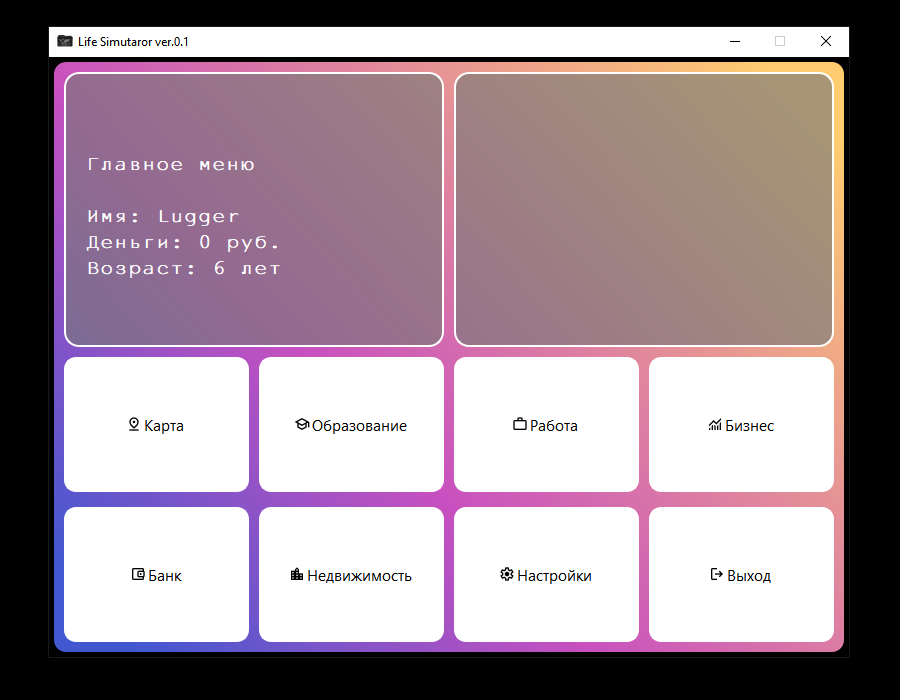

#  Life-Simulator

?label=Author&labelColor=rgb(120%2C%20120%2C%20120))

*Визуальное представление UIX дизайна.*

# Основная информация о проекте
Что такое **Life Simulator** - Это симулятор жизни, которую можно **полностью** подстроить под себя, вплоть от профессии и образования до внешнего вида.

Больших системных требований проект с вас `не потребует!` Единственное, что сдесь может потребоваться, так это место для базы данных самого проекта, так как оно достаточно велико и огромно (пока-что не так сильно, но планируется её наполнить до хотя-бы 150 мегабайт).

## Какие планы?
- [ ] Сделать рабочей локацию `Карта Мира`
  - [ ] Сделать минимум 20 городов-стран
- [x] Сделать рабочей локацию `Образование`
  - [ ] Обработать логику ценности образования
- [x] Сделать рабочей локацию `Работа`
  - [ ] Добавить контроль наличия образования
- [ ] Сделать рабочей локацию `Бизнес`
  - [ ] Добавить минимум 5-10 бизнесов
- [ ] Сделать рабочей локацию `Банк`
  - [ ] Построить банковскую логику
    - [ ] Добавить кредиты/вклады
    - [ ] Добавить финансовые льготы и тд.
    - [ ] Добавить фиксацию кредитной истории
- [ ] Сделать рабочей локацию `Недвижимость`
- [X] Сделать рабочей локацию `Настройки`
  - [ ] Добавить несколько тем оформления
- [ ] Добавить магазин периферии, бонусы
- [ ] Добавить игре онлайн `на далёкое будущее`

# Загрузка/Download

## Отдельное спасибо важным людям
Спасибо вам!
* Создатель: Lugger
* Тестер: Sintetik

